# Rock Paper Scissor AI

Ever felt bored alone? Let's play rock, paper, and scissors against an interactive system powered with intelligence. :D
The Demo Video is available at: https://youtu.be/KHPwITtZUrI

## Requirements

### Hardware
* Rock Paper Scissor AI
* Things used in this project
* Hardware components
* Raspberry Pi 3 Model B+	
* Raspberry Pi Camera Module V2
* SG90 Micro-servo motor

### Software
* Raspbian	
* OpenCV
* TensorFlow	

## Idea 💡
After working on various projects on different domains, I planned to make a fun project, and I decided to make a rock-paper-scissors game :)

In this project, we will make an interactive game and play against the computer which is powered by AI to make decisions. AI uses the Camera connected to the Raspberry Pi to recognize what moves the user made with the hand, classify them into the best category(label) rock, paper, or scissors. Once the computer makes its move, the stepper motor connected to the Raspberry Pi points towards the direction based on its move.

Rules which has to be considered for this game:

  * Rock blunts the scissor
  * Paper covers the rock
  * Scissors cut paper
  
Winner will be decided based on the above three conditions.

Let's see a quick demo of the project here.

[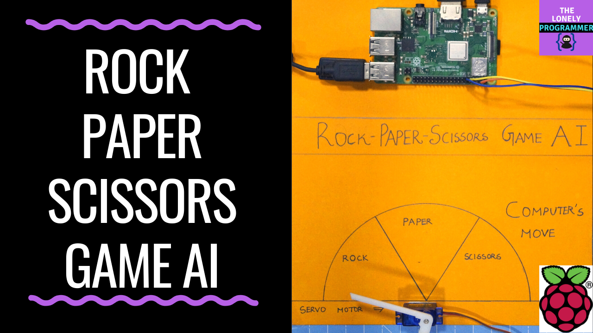](https://youtu.be/KHPwITtZUrI "Working of the Project - Click to Watch!")

## Getting Started 🎬
I've used a Raspberry Pi 3 Model B+ which has great enhancements and is More Powerful than the earlier Raspberry Pi 3 Model B.

Raspberry Pi 3 B+ is integrated with the 1.4GHz 64-bit quad-core processor, dual-band wireless LAN, Bluetooth 4.2/BLE, faster Ethernet, and Power-over-Ethernet support (with separate PoE HAT).

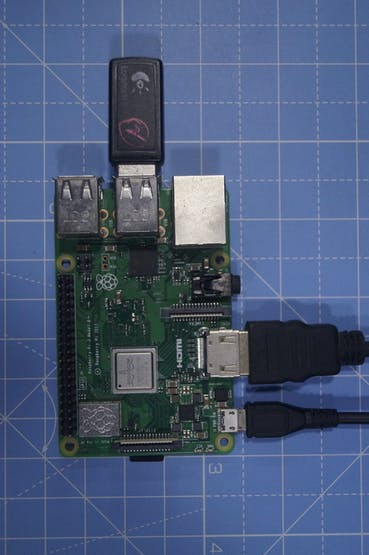


Specifications:

* Broadcom BCM2837B0, Cortex-A53 (ARMv8) 64-bit SoC @ 1.4GHz
* 1GB LPDDR2 SDRAM
* 2.4GHz and 5GHz IEEE 802.11.b/g/n/ac wireless LAN, Bluetooth 4.2, BLE
* Gigabit Ethernet over USB 2.0 (maximum throughput of 300 Mbps)
* The extended 40-pin GPIO header
* Full-size HDMI
* 4 USB 2.0 ports
* CSI camera port for connecting a Raspberry Pi camera
* DSI display port for connecting a Raspberry Pi touchscreen display
* 4-pole stereo output and composite video port
* Micro SD port for loading your operating system and storing data
* 5V/2.5A DC power input
* Power-over-Ethernet (PoE) support (requires separate PoE HAT)

We use an SG-90 servo motor, a high torque motor that can handle the load up to 2.5kg (1cm).

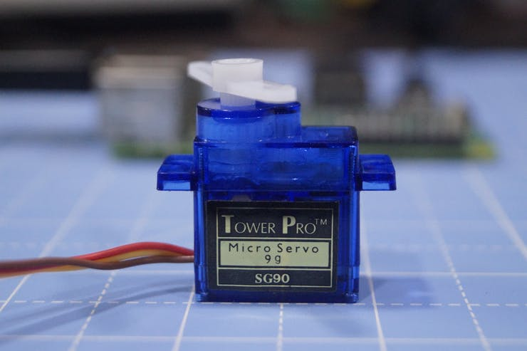

A USB camera to make the game interactive with the image processing

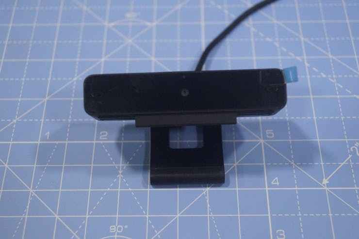

These are the overall components used for this project.

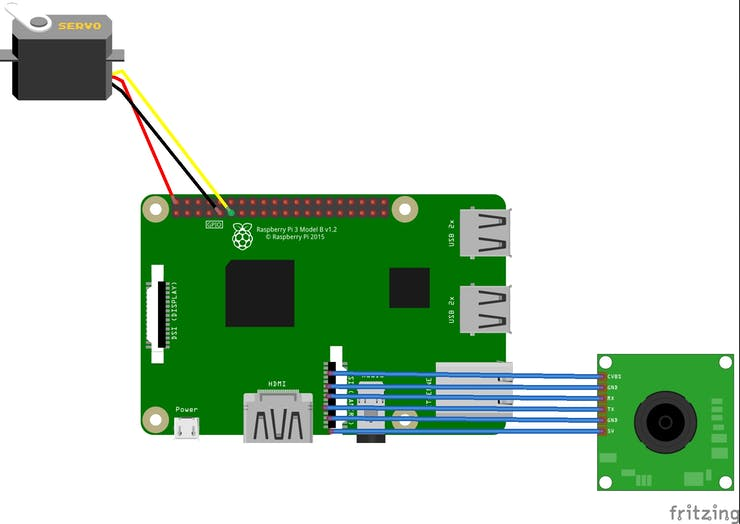

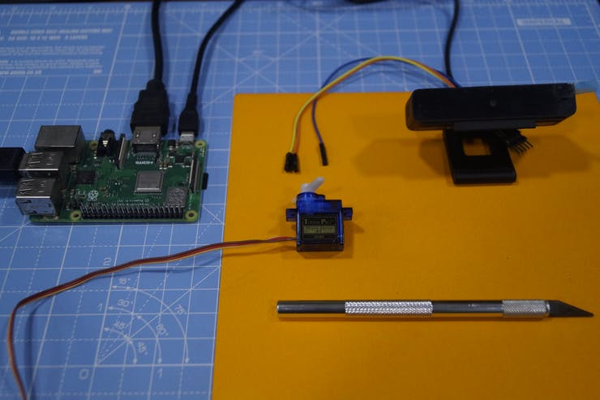

Some Jumper cables are used to wire the stepper motor and Raspberry Pi.

## Burn Raspbian to the SD card 🔥

Raspbian is the Linux distribution of choice running on the Raspberry Pi. In this guide, we will be using the Lite version, but the Desktop version (which comes with a graphical environment) can be used as well.

* Download Etcher and install it.
* Connect an SD card reader with the SD card inside.
* Open Etcher and select from your hard drive the Raspberry Pi .img or .zip file you wish to write to the SD card.
* Select the SD card you wish to write your image to.
* Review your selections and click 'Flash!' to begin writing data to the SD card.

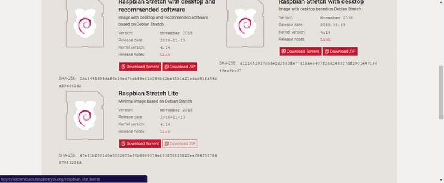

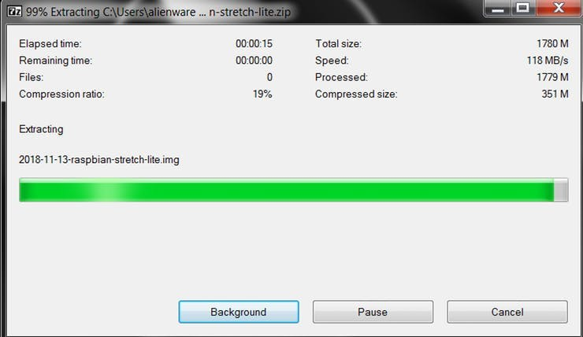

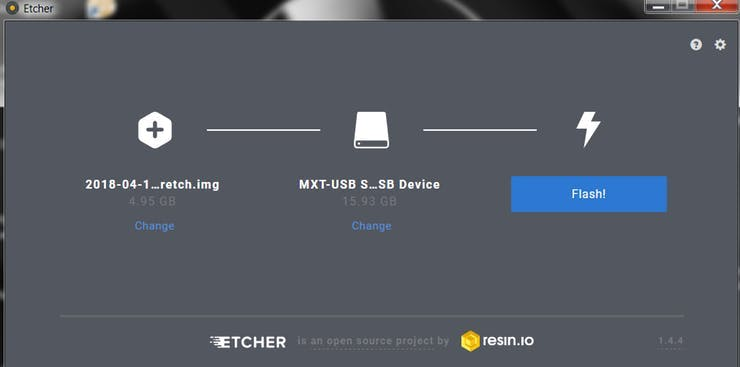

**Connect the device to your network**

* Enable SSH access by adding empty file ssh, again placed at the root of the boot volume on your SD card.
* Insert the SD card into the Raspberry Pi. It will boot in roughly 20 seconds. You should now have SSH access to your Raspberry Pi. By default, its hostname will be raspberrypi.local. On your computer, open a terminal window and type the following:
ssh pi@raspberrypi.local

```
The default password is **raspberry**
```

*Here I've used a separate monitor to interface with the Raspberry Pi.*

## Collecting the Dataset 🗄️

The first step in this project is data collection. The System has to identify the hand gesture and recognize the action and make it's move accordingly.

We install several libraries to the Raspberry Pi using pip install **<package_name>** command.

```
sudo apt-get update && sudo apt-get upgrade
sudo apt-get install libjpeg-dev libtiff5-dev libjasper-dev libpng12-dev
pip install opencv
pip install numpy 
pip install scikit-learn
pip install scikit-image
pip install h5py
pip install Keras
pip install tensorflow
pip install Werkzeug
pip install Keras-Applications
pip install Keras-Preprocessing
pip install keras-squeezenet
pip install astor
pip install tensorboard
pip install tensorflow-estimator
pip install mock
pip install grpcio
pip install absl-py
pip install gast
pip install joblib
pip install Markdown
pip install protobuf
pip install PyYAML
pip install six
```

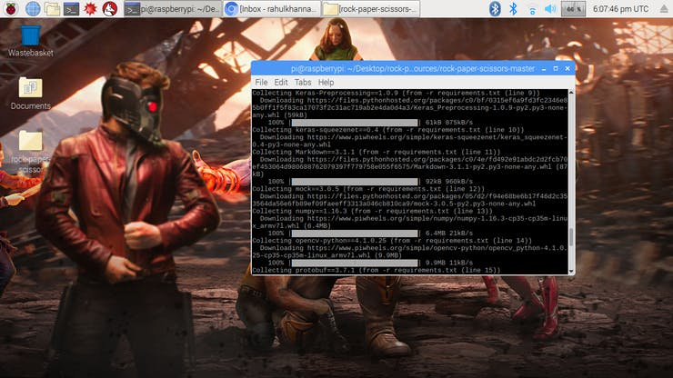


If you face any issues with the OpenCVpackage, I strongly recommend installing these packages.

```
sudo apt-get install libhdf5-dev 
sudo apt-get install libhdf5-serial-dev 
sudo apt-get install libatlas-base-dev 
sudo apt-get install libjasper-dev  
sudo apt-get install libqtgui4  
sudo apt-get install libqt4-test
```

We have installed all the required dependencies for this project. The Data-set is made by collections and arrangements of the images under the appropriate label.

Here we create the data set images for the label rock, paper and scissor using the following snippet.

```
roi = frame[100:500, 100:500]
save_path = os.path.join(img_class_path, '{}.jpg'.format(count + 1))
cv2.imwrite(save_path, roi)
```

The image is captured for each label (rock, paper, scissor and None).

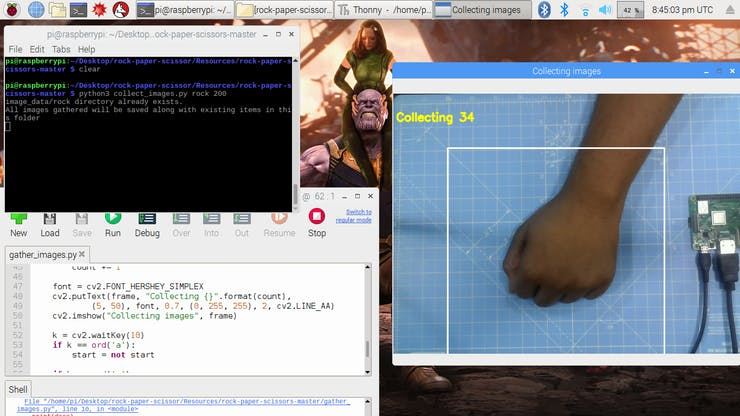

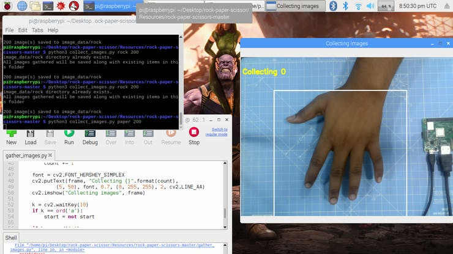

## Designing a NN & Training the Model ⚒️⚙️
The Core of this project is an image classifier that classifies one of three categories. To make this Classifier, we use the pre-trained CNN (Convolutional Network) called SqueezeNet.

Here we use Keras and TensorFlow to generate the SqueezeNet model which can identify the gesture. The images which we generated in the previous step are used to train the model. The model is trained using the Dataset generated for no of Epochs (Cycles) mentioned.

The model is configured with the hyperparameters as shown below.

```
model = Sequential([
SqueezeNet(input_shape=(227, 227, 3), include_top=False),
Dropout(0.5),
Convolution2D(NUM_CLASSES, (1, 1), padding='valid'),
Activation('relu'),
GlobalAveragePooling2D(),
Activation('softmax')
])
```

While the model is training, you can find the loss and accuracy of the model for each Epoch and the accuracy increases at some point in time after a few Epoch.

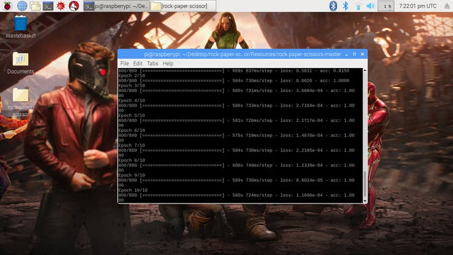

It roughly took 2 hour to generate the model with the highest accuracy after 10 epoch.

If you face any memory allocation errors, do the following steps (Thanks to **Adrian**)

To increase your swap space, open up /etc/dphys-swapfile and then edit the CONF_SWAPSIZE variable:

```
# CONF_SWAPSIZE=100
CONF_SWAPSIZE=1024
```

Notice that I am increasing the swap from 100MB to 1024MB.

From there, restart the swap service:

```
$ sudo /etc/init.d/dphys-swapfile stop
$ sudo /etc/init.d/dphys-swapfile start
```

Note: Increasing swap size is a great way to burn out your memory card, so be sure to revert this change and restart the swap service when you’re done. You can read more about large sizes corrupting memory cards here.

## Testing the Model ✅

Once the model is generated, It produces the output file "rock-paper-scissors-model.h5". This file is used as the source to test whether the system can identify different hand gestures and able to differentiate the actions.

The model is loaded in the python script as follows

```
model = load_model("rock-paper-scissors-model.h5")
```

The camera reads the test image and transform the required color model, and then resize the image to 227 x 227 pixel (Same size used for model generation). The images which were used for training the model can be used to test the generated model.

```
img = cv2.imread(filepath)
img = cv2.cvtColor(img, cv2.COLOR_BGR2RGB)
img = cv2.resize(img, (227, 227))
```

Once the model is loaded and the image is acquired by the camera, the model predicts the captured image using the SqueezeNet model loaded, and make the prediction for the user's movements.

```
pred = model.predict(np.array([img]))
move_code = np.argmax(pred[0])
move_name = mapper(move_code)
print("Predicted: {}".format(move_name))
```

Run the test.py script to test the model with various test images.

```
python3 test.py <testimage>
```
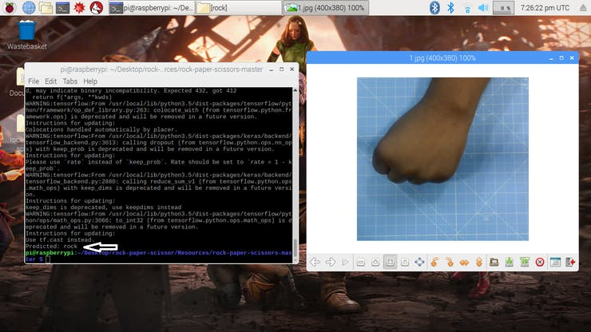

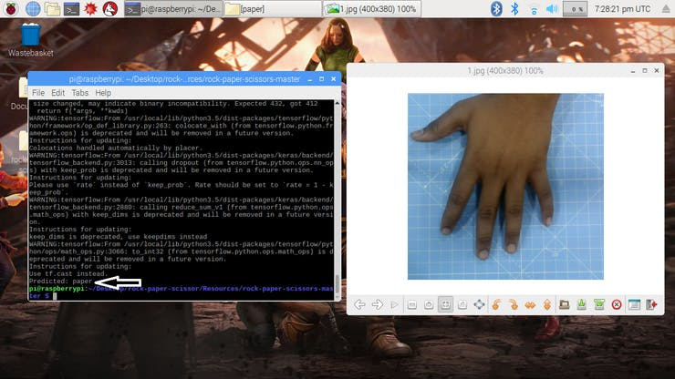

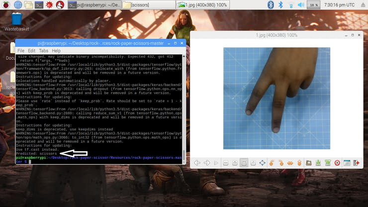

Now the model is ready to detect and understand the hand gestures.

## Rock-Paper-Scissors game

The Game uses a random number generation function to decide the computer's move. It follows the above-said rules to determine the winner. The game is designed with two modes: Normal Mode and Intelligent mode, where intelligent mode counterattack the user's movement, i.e Computer wins all the moves against the user.

```
cap = cv2.VideoCapture(0) # To capture image from the Camera
```

Now let's make the game in Normal mode where the system/ Raspberry Pi takes the picture of the hand and analyzes and identifies the hand gesture. Then using a random number generator, the computer move is played. The winner is chosen based on the rules and then displayed on the screen.

Start the game using the following command.

```
python3 play.py
```

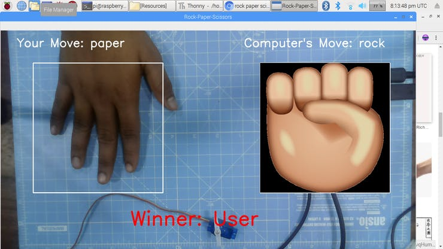

## Servo Motor Integration 🔗
At last, add the servo motor to this project. Servo motor is GPIO pin 17 of the Raspberry Pi, which has the PWM function to control the angle of rotation.

The Servo Motor used in this project is SG-90. It can make rotations clockwise and anti-clockwise up to 180 °

The Connections are given as follows.

| Servo Motor         |   Raspberry Pi  |
|-----------------------|---------------|
| Vcc |  +5V |
| Signal |  GPIO17 |
| GND |  GND |

The libraries such as RPi.GPIO and time are used in this project.

```
import RPi.GPIO as GPIO 
import time
```

The GPIO pin is then configured to PWM using the following lines

```
servoPIN = 17
GPIO.setmode(GPIO.BCM)
GPIO.setup(servoPIN, GPIO.OUT)
```

GPIO Pin 17 is configured to use as a PWM at the frequency of 50Hz. The Angle of the servo motor is achieved by setting the duty cycle (Ton & Toff) of the PWM

```
duty = angle/18 + 2
GPIO.output(servoPIN, True)
p.ChangeDutyCycle(duty)
time.sleep(1)
GPIO.output(servoPIN, False)
p.ChangeDutyCycle(0)
```

This will produce the desired step angle for every pulse, which would give the desired angle of rotation.

Now I have taken the chart and sliced it into three sections, for rock, paper, and scissor. The Servo motor is fixed to the center of the chart. The pointer/flap is connected to the shaft of the servo motor. This shaft points to the computer's move according to the logic computed in the script.

## Working of the Project 🔭
And now, it's playtime. Let's see the working of the project.

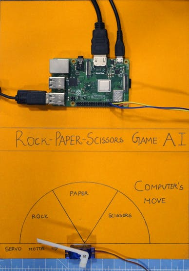

[](https://youtu.be/2lwCU4bWY0c "Working of the Project - Click to Watch!")


*If you faced any issues in building this project, feel free to ask me. Please do suggest new projects that you want me to do next.*

*Share this video if you like.*

*Happy to have you subscribed: https://www.youtube.com/c/rahulkhanna24june?sub_confirmation=1*

**Thanks for reading!**
